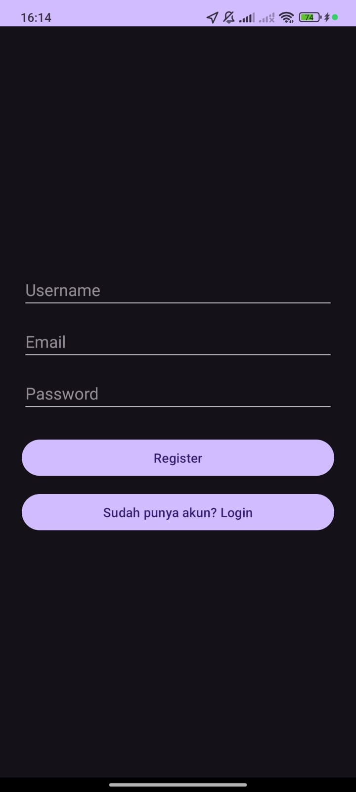
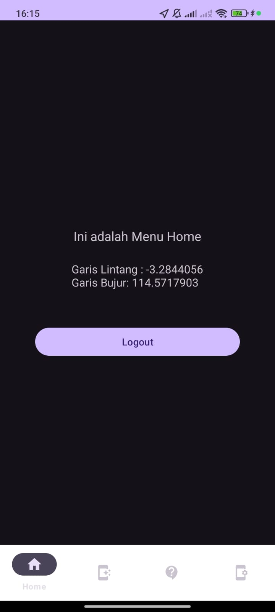
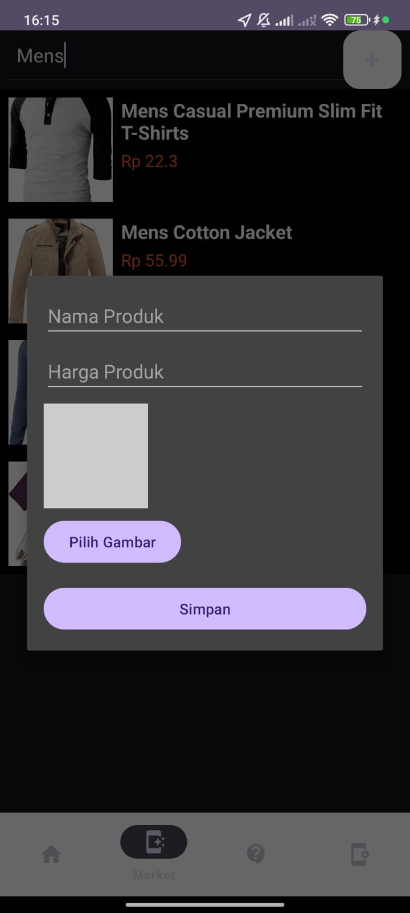

# 🛒 Aplikasi Toserba

**Toserba** adalah aplikasi Android yang dikembangkan menggunakan **Android Studio**. Aplikasi ini memiliki berbagai fitur menarik yang memudahkan pengguna dalam mengakses layanan toko serba ada.

---

## ✨ Fitur Utama

### 1. Login
- Pengguna dapat login biasa atau login dengan menggunakan akun Google
- Validasi email dan password.

  

---

### 2. Register (Pendaftaran Akun)
- Pengguna baru dapat mendaftar akun langsung dari aplikasi.

  

---

### 3. Fitur GPS dan Logout
- Aplikasi mendeteksi lokasi pengguna menggunakan GPS.
- Menampilkan informasi **garis lintang** dan **garis bujur** secara real-time.
- Digunakan untuk melacak lokasi.
- Ada juga tombol logout untuk keluar dari akun.

  

---

### 4. Fitur Pencarian Produk
- Pengguna dapat mencari produk yang tersedia di dalam aplikasi.
- Menyediakan tampilan hasil pencarian.

  

---

### 5. Menambahkan Produk Sendiri
- Pengguna dapat menambahkan produk sendiri ke dalam daftar.
- Form penambahan produk dengan input nama, harga, dan gambar produk.

  

---

## 🛠️ Teknologi yang Digunakan

- **Android Studio** (Java/Kotlin)
- **Firebase Authentication** 
- **RecyclerView** untuk tampilan daftar produk
- **XML Layout** untuk desain UI

---
